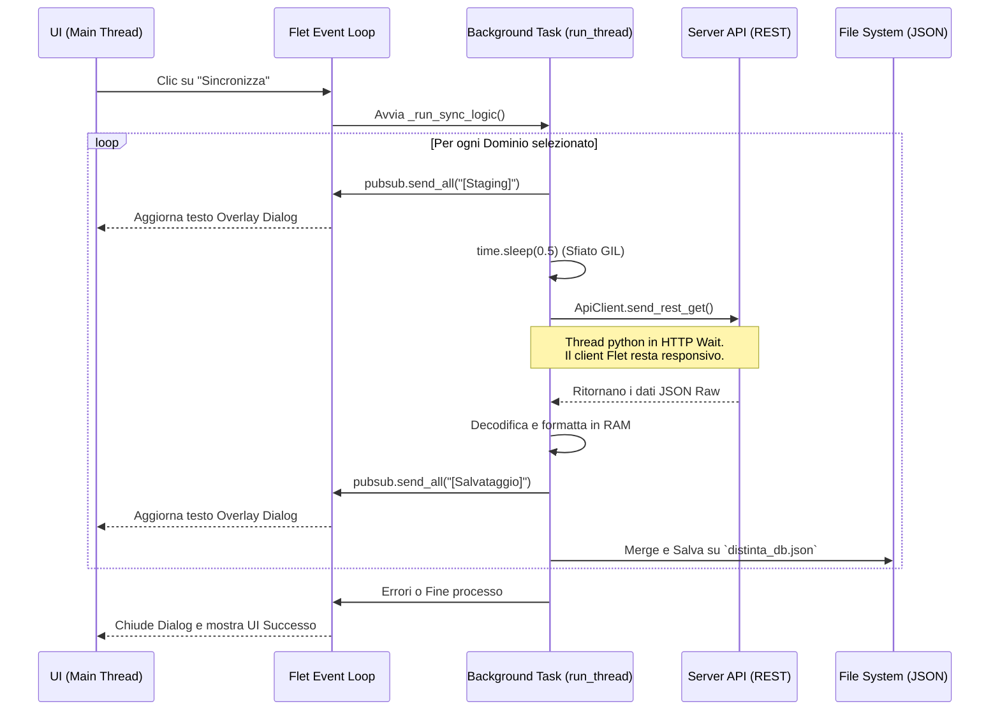

# SAT (Solution Architect Tool)

SAT è un'applicazione desktop stand-alone sviluppata parzialmente sopra il framework **Flet** (Python). Fornisce un'interfaccia utente moderna derivata da Flutter per la gestione, l'estrazione e l'analisi massiva dei Master Data aziendali.

## Struttura e Moduli
L'applicazione è suddivisa in diverse macro-aree specializzate accessibili dal pannello laterale:

*   **`main.py` / `app.py`**: Entry point e core logico dell'architettura. Mantiene in stato la cache RAM (`distinta_db.json`), il logger integrato e la navigazione tra le pagine.
*   **`settings.py`**: Centro nevralgico della sincronizzazione. La connessione API in background estrae oltre 24.000 record globali raggruppati per *Configuration Items*, *Domains*, *Solution Designs*, *Teams*, *BB Instances* e *Technologies*. Grazie a un'architettura **Asincrona a PubSub**, Flet garantisce che l'interfaccia non vada in freeze termico sotto Windows delegando tutti i task ad un background worker incrementale.
*   **`ciometro.py` / `ciometro_massivo.py`**: Moduli di analisi dedicati ai Configuration Item (singoli o caricati da template excel tramite i file picker).
*   **`api_client.py` & `api_queries.py`**: Interfacce di connessione bloccanti destinate alla richiesta e alla sanitizzazione del payload REST in ingresso.
*   **`ci_esistenti.py` / `panoramica.py`**: Tabelle di aggregazione visuale e metriche sui CI e i relativi domini associati presenti a sistema.

## File Generati in Locale
L'app utilizza dei database in formato testuale leggero per non appesantire il caricamento:
*   `sat_config.json`: Chiave API, statistiche ultima esecuzione e livello verbosità log.
*   `distinta_db.json`: Il Database vero e proprio esportato dai tool di configurazione originali. Persiste finché non viene manualmente sincronizzato l'update massivo.
*   `log.txt`: Traccia diagnostica ad alta risoluzione (%H:%M:%S.%f). Essenziale per fare debug su rallentamenti REST o memory leak durante la decodifica dei JSON enormi.

## Avvio rapido per Sviluppatori
1. Assicurarsi di aver salvato i requirement principali: `flet`, `requests`, `pandas`.
2. Eseguire l'applicazione con il comando:
   ```bash
   python main.py
   ```
3. (Opzionale) Compilare per Windows usando PyInstaller integrando gli hook di Flet standard.
4. Una volta in UI, spostarsi nella tab "Impostazioni", incollare il proprio Token e selezionare con le checkbox quali aree del database scaricare localmente.

## Architettura e Multi-Threading (Fix Flet Windows)
Per garantire una UI reattiva:
1. Le chiamate limitate da "Networking I/O" non invocano mai `threading.Thread()`, il quale non comunica lo svuotamento del buffer del GIL al sistema operativo su Windows.
2. Viene invocato esclusivamente il gestore Flet nativo: `self.app.page.run_thread()`.
3. Gli aggiornamenti dei test dei Popup (dialoghi caricamento modale) sfruttano il servizio di notifica interna `page.pubsub.subscribe/send_all`. In questo modo Flet inserisce il repaint grafico in una queue asincrona pura aggirando i classici colli di bottiglia causati dalla libreria nativa `requests.get`.

### Diagramma Sincronizzazione Modulare

